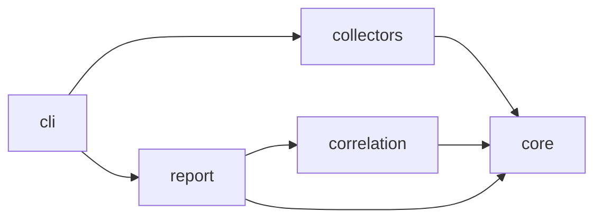
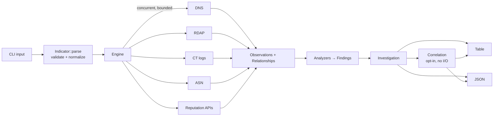
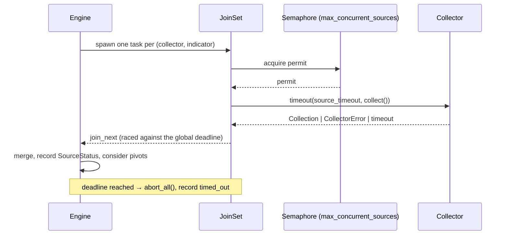

# Architecture

This document describes the architecture of Sentinel OSINT v0.1 and the
extension points reserved for the roadmap. It is the reference for crate
boundaries and the data model.

## Design goals

1. **Passive-first.** Collect from public, legitimate sources; never touch
   target infrastructure beyond normal DNS resolution.
2. **Evidence-based.** Every piece of data is traceable to a source, a time,
   and a response hash.
3. **Facts vs. judgments.** Collectors produce *observations*; analysis produces
   *findings* that cite observations.
4. **Partial failure is normal.** One source failing never aborts an investigation.
5. **Testable without the internet.** All I/O sits behind interfaces that can be
   mocked.
6. **Extensible without rewrites.** Persistence, graphs and new report formats
   consume the same `Investigation` model.

## Crates

```
crates/
├── core/        sentinel-core
├── collectors/  sentinel-collectors
├── correlation/ sentinel-correlation
├── report/      sentinel-report
└── cli/         sentinel-cli  (binary: sentinel-osint)
```



| Crate | Responsibility | I/O |
|---|---|---|
| `sentinel-core` | Domain model, indicator parsing/validation, confidence, evidence, relationships, findings, investigation aggregate | None |
| `sentinel-collectors` | `Collector` trait, source implementations, hardened HTTP client, DNS abstraction, engine that runs collectors, finding analyzers | Network |
| `sentinel-correlation` | Explainable correlation of a finished investigation (chains, shared infrastructure, provider agreement and disagreement), step 8 | None: direct dependencies limited to `core`, `serde`, `sha2` and no I/O APIs in its source (both enforced by `tests/no_io.rs`) |
| `sentinel-report` | Renderers: table and JSON, with an optional correlation section (STIX: after v0.1) | None (returns strings/writers) |
| `sentinel-cli` | Argument parsing, config and secrets loading, wiring, output files, exit codes | Terminal, files |

`core` has no dependency on Tokio, reqwest, or any workspace crate. This keeps
the model reusable by future persistence (Phase 2), graph (Phase 3), and REST
API (Phase 4) layers.

## Investigation pipeline



1. **Parse.** The CLI parses the indicator into a validated `Indicator`.
   Invalid input fails before any network activity.
2. **Plan.** The engine selects collectors that support the indicator type,
   and on which API keys are configured (`--sources` is not available in
   v0.1, L12).
3. **Collect.** Collectors run concurrently under a global deadline. Each
   returns observations and relationships, or an error recorded as a
   `SourceStatus`.
4. **Pivot (bounded).** For a domain, resolved A/AAAA addresses are enriched
   with ASN data only (cheap, DNS-based), capped at a fixed number of addresses.
   Reputation APIs run only on the primary indicator in v0.1.
5. **Analyze.** Analyzers turn observations into findings (for example, SPF
   `+all`, missing DMARC, no CAA).
6. **Render.** A renderer turns the finished `Investigation` into output.

## Core data model (`sentinel-core`)

Status: **implemented (v0.1, step 1).**

| Module | Contents |
|---|---|
| `indicator` | `Indicator` (`Domain`, `Ipv4`, `Ipv6`, `Url`, `FileHash`), `IndicatorType`, `DomainName`, `HttpUrl`, `FileHash`/`HashAlgorithm`, `refang`, `IndicatorError` |
| `net` | `AddressScope` classification of IPs (used by the target policy and, later, the SSRF guard) |
| `evidence` | `Observation`, `ObservationId`, `ObservationData`, `SourceId`, `Provenance`, `Sha256Digest`, DNS record types, `sanitize_url` |
| `confidence` | `Confidence` (0–100, STIX scale) and `ConfidenceLevel` |
| `entity` | `Entity` (indicator or `Asn`) and `EntityType` |
| `relationship` | `Relationship`, `RelationKind` |
| `finding` | `Finding`, `FindingCode`, `Severity` |
| `investigation` | `Investigation`, `SourceStatus`, `SourceOutcome`, `ToolInfo` |
| `time` | `Timestamp` (`DateTime<Utc>`) and RFC 3339 millisecond formatting |

### Indicators: syntax vs. policy

Input goes through two separate layers:

1. **Syntax** (`Indicator::parse_domain/_ip/_url/_file_hash`). Bounds the
   raw length, trims, **refangs** (`evil[.]com`, `hxxps://`), normalizes
   (IDNA, lowercase, canonical IPv6), and validates. Any syntactically valid
   value is accepted, including `10.0.0.5` or `mail.corp.internal`, because
   such values legitimately appear as *related* entities. An A record that
   points to a private address is itself worth reporting.
2. **Policy** (`Indicator::ensure_investigable`). Decides whether a value
   may be the *target* of an investigation, i.e. be sent to public sources.
   Non-global IPs (classified by `net::classify`) and special-use domains
   (`.local`, `.internal`, `.onion`, `.home.arpa`, …) are rejected, and the
   same check applies to URL hosts. `Investigation::new` enforces it, so an
   investigation of a non-investigable target cannot exist.

Deserializing an `Indicator` runs the same parser, so serialized data is
never trusted blindly. Error messages never echo raw input, which protects
terminals from escape sequences.

### Observations and provenance

```rust
Observation {
    id: ObservationId,               // UUIDv4
    indicator: Indicator,            // subject of the fact
    source: SourceId,                // "dns", "rdap", … (validated at compile time)
    collected_at: Timestamp,         // UTC, supplied by the caller
    data: ObservationData,           // typed payload, #[non_exhaustive]
    confidence: Confidence,          // 0..=100
    provenance: Provenance,          // Dns{query_name, record_type, resolver}
                                     // | Https{http_method, endpoint (sanitized), status}
    raw_response_hash: Option<Sha256Digest>,
}
```

- `ObservationData` currently has `DnsRecord` (A, AAAA, MX, NS, TXT, CNAME,
  SOA, CAA, fully typed). Each later collector adds its own variant (ASN,
  RDAP registration, CT name, reputation) in the step that implements it.
  Variants are not designed ahead of the sources.
- DNS-sourced names are stored **as received** (lowercased, no trailing dot)
  and are not coerced into `DomainName`. Evidence stays faithful, and
  sanitization happens at render time.
- `Provenance::https` always passes the URL through `sanitize_url`, which
  removes userinfo and fragments and redacts sensitive query parameters.
  There is no other way to construct HTTPS provenance.
- **The core never reads the clock.** `chrono` is compiled without its
  `clock` feature, so `Utc::now()` does not exist in this crate. Timestamps
  are always injected, which keeps the model deterministic in tests.

### Relationships, findings, investigation

- `Relationship::new` validates that the kind fits the entity types
  (`resolves_to`: domain→IP, `alias_of`/`has_mail_exchanger`/`has_nameserver`:
  domain→domain, `announced_by`: IP→AS, `registered_in`: IP→network) and requires at least one observation
  as evidence.
- `Finding` has a stable `FindingCode` (e.g. `dns.dmarc.policy_none`) that
  machines key on, plus severity, confidence, human text, and evidence IDs.
- `Investigation` enforces referential integrity: relationships and findings
  may only cite observations it contains. Duplicate edges are merged, and
  `finish()` cannot be earlier than the start.

The JSON shape is pinned by `crates/core/tests/json_contract.rs` and, for
the evidence kinds and the correlation member, by `crates/report/tests/json.rs`.

## Collectors (`sentinel-collectors`)

Status: **HTTP client, collector trait and engine (step 2); DNS resolver,
DNS collector and analyzers (step 3); ASN (Cymru) and RDAP collectors
(step 4); CT collector (step 5); AbuseIPDB (step 6), VirusTotal (step 7A),
URLhaus (step 7B) and MalwareBazaar (step 9) reputation providers.**

```
collectors/src/
├── lib.rs
├── clock.rs          Clock trait + SystemClock: the only entry point of wall-clock time
├── collector.rs      Collector trait, Collection, CollectContext, CollectorError, request budget
├── engine/           Engine: concurrency, deadlines, source statuses, bounded pivots
├── dns/              DnsResolver trait + HickoryResolver (system config, no hosts file, FQDN only)
├── analysis/         pure analyzers: observations → findings (spf, dmarc, caa, records)
├── sources/dns.rs    DNS collector: fixed 9-query plan, limits, evidence, relationships
├── sources/cymru.rs  ASN collector: Team Cymru IP→ASN over DNS (IPv4 + IPv6)
├── sources/rdap/     RDAP collector: IANA bootstrap, ip network lookup, defensive JSON parsing
├── sources/ct/       CT collector: crt.sh, name classification, certificate dedup, bounded
├── sources/abuseipdb/ AbuseIPDB IP reputation (keyed provider)
└── http/             hardened HTTP client
    ├── policy.rs     NetworkPolicy: HTTPS only, public IPs only, redirect rules
    ├── resolver.rs   DNS resolver that yields only public addresses (anti-rebinding)
    ├── client.rs     HttpClient: timeouts, size caps, redirect validation, concurrency
    └── message.rs    HttpRequest (secret headers) / HttpResponse (hash, provenance)
```

### Collector trait

```rust
pub trait Collector: Send + Sync {
    fn id(&self) -> SourceId;
    fn supports(&self, indicator: &Indicator) -> bool;
    fn scope(&self) -> CollectorScope { TargetOnly }     // or TargetAndPivots
    fn availability(&self) -> Availability { Ready }     // or Unavailable{reason}
    fn collect<'a>(&'a self, indicator: &'a Indicator, ctx: &'a CollectContext)
        -> CollectFuture<'a>;                             // boxed future, dyn-safe
}
```

- A collector receives an indicator that already passed `ensure_investigable`,
  and returns a `Collection` (observations, relationships, findings, pivot
  candidates). It never mutates the `Investigation`: the engine merges
  collections, so integrity checks and limits live in one place.
- All network access goes through `CollectContext` (`send` for HTTP,
  `acquire_request` for anything else), which charges the per-investigation
  request budget.
- `CollectorError` messages are `&'static str` or typed values, so response
  content cannot end up in errors or logs.
- The boxed-future signature avoids an `async-trait` dependency and keeps
  the trait object-safe (`Arc<dyn Collector>`).

### Concurrent execution model



- Every task is spawned into a `JoinSet`. A semaphore bounds how many run at
  once, and the permit is held for the whole run.
- Each run is wrapped in `tokio::time::timeout(source_timeout)`. The
  engine's `join_next` is raced against the global deadline. When the
  deadline hits, all tasks are aborted (dropping in-flight HTTP requests)
  and recorded as `timed_out` (`limit: investigation`).
- A task that panics is isolated by the `JoinSet` and recorded as `failed`.
- Every run produces exactly one `SourceStatus` with the indicator it ran
  on. The states are distinct and never collapsed:

  | State | Meaning |
  |---|---|
  | `succeeded` | Ran and answered (possibly with zero observations or an empty result). |
  | `partial` | Ran; some of its queries failed (listed). |
  | `unavailable` | Not runnable: e.g. API key missing or invalid (one status per source). |
  | `budget_exhausted` | Not run: the investigation's request budget was used up. |
  | `failed` | Ran and failed (HTTP status, invalid response, network error). |
  | `timed_out` | Cut by the source timeout or the investigation deadline. |
  | `unsupported` | Never saw an indicator it supports in this investigation. |

  "No data" is only ever `succeeded` with an empty result. The other
  states are never reported as "no data".
- `tracing` spans: `investigation{id, target}` › `source{source, indicator, depth}`.

### Pivot limits

A collection may suggest pivots (e.g. DNS → resolved IPs). A pivot is
followed only if **all** of these hold:

1. its depth (target = 0) is ≤ `max_depth` (default 1);
2. fewer than `max_entities` pivots have been followed (default 10);
3. it has not been seen before (visited set, which prevents cycles);
4. it passes `ensure_investigable` (private IPs from DNS are never sent to
   third parties).

Only collectors with `CollectorScope::TargetAndPivots` run on pivots. At
most `MAX_PIVOT_CANDIDATES` (1,000) candidates are examined per collection.
`RunStats` reports followed and dropped pivots, requests used, and whether
the deadline was hit.

### HTTP client

See `docs/THREAT-MODEL.md` T3/T4/T6 for the security rationale. In short:
HTTPS only; public addresses only, checked before sending, on every
redirect, and at DNS resolution; ≤ 3 redirects, same-origin only for
authenticated requests; connect and total timeouts; size cap checked while
streaming; no decompression, proxy, cookies, retries or `Referer`; a bound
on concurrent requests.

### Infrastructure intelligence (step 4)

Goal: *what network and organization is associated with a public IP, and
what does the authoritative registry say about the allocation?* This is
enrichment, not attribution.

```
domain ──DNS A/AAAA──▶ public IP pivot ──┬──▶ cymru: IP → origin AS (+ AS description)
                        (engine policy)   └──▶ rdap:  bootstrap → registry → ip network
target IP (--ip) ────────────────────────┘
```

- **Pivots.** Only typed IP indicators from A/AAAA records become pivots.
  The existing engine policy applies unchanged: depth ≤ 1, at most 10
  entities, deduplication (each IP is enriched once per investigation),
  `ensure_investigable` (non-public IPs stay data and are never sent
  anywhere), the request budget and deadlines. Both collectors have
  `CollectorScope::TargetAndPivots` and **re-check** `ensure_investigable`
  themselves (defense in depth, `CollectorError::RefusedTarget`).
- **ASN (`cymru`).** DNS TXT queries through the shared `DnsResolver`
  (budgeted, 8 s timeout each): one origin query
  (`<reversed IPv4>.origin.asn.cymru.com` / `<nibbles>.origin6.asn.cymru.com`),
  then one `AS<n>.asn.cymru.com` per distinct origin AS (at most 4). The
  pipe-separated answers are parsed field by field; invalid fields are
  dropped and listed in `issues`, and the verbatim answer is kept in
  `source_text`.
- **RDAP (`rdap`).** The IANA bootstrap (`ipv4.json` / `ipv6.json`, RFC 9224)
  is fetched **through the same hardened HTTP client** (budgeted, 512 KiB
  cap), parsed as untrusted data (HTTPS base URLs only, no credentials,
  bounded entries) and cached for the process (`tokio::sync::OnceCell`, one
  fetch even under concurrency). The most specific covering service is
  queried with `GET <base>/ip/<address>` (URL built from path segments,
  1 MiB cap). Registry-to-registry redirects are handled by the HTTP
  client's redirect policy, so there is **no second SSRF implementation**.
- **Parsing RDAP.** `serde_json::Value` (bounded by the body cap; nesting
  bounded by serde_json's recursion limit), then explicit extraction of a
  fixed set of fields with type, value and size checks. Only an
  `objectClassName` other than `ip network` rejects the document. Other
  problems degrade to `issues`. Entities are walked iteratively (depth ≤ 4,
  ≤ 64 entities). Only the registrant *organization* name and the abuse
  mailbox of non-individual entities are kept: no people, addresses or
  phone numbers.

#### Data model

| Observation | Source | Key fields |
|---|---|---|
| `asn_origin` | cymru | `ip`, `asns[]`, `prefix`, `country`, `registry`, `allocated`, `source_text`, `issues[]` |
| `asn_description` | cymru | `asn`, `name`, `country`, `registry`, `allocated`, `source_text`, `issues[]` |
| `dns_no_records` | cymru | the origin query had no answer (not announced) |
| `network_registration` | rdap | `queried_ip`, `handle`, `name`, `network_type`, `ip_version`, `start_address`, `end_address`, `cidrs[]`, `parent_handle`, `country`, `status[]`, `registered_at`, `last_changed_at`, `organization`, `abuse_email`, `issues[]` |

New core types: `IpPrefix` (strict CIDR: host bits must be zero) and the
`network` entity. Relationships: `announced_by` (IP → AS, a routing fact)
and `registered_in` (IP → most specific reported CIDR that contains it).
`belongs_to` was renamed to `announced_by` before anything emitted it.

**Source fact, normalized value, derived data** are kept apart: the
verbatim ASN answer and the RDAP response digest are the source facts. The
typed fields are normalized values; a value is left empty rather than
"repaired". Relationships and findings are derived and cite observations.

#### Confidence

Confidence measures trust in the **data**, never danger:

| Data | Confidence | Why |
|---|---|---|
| RDAP response without issues | 95 | Authoritative registry, over HTTPS |
| RDAP response with issues | 70 | Authoritative, but partially invalid |
| Cymru answer without issues | 85 | Aggregated BGP view, over non-DNSSEC-validated DNS |
| Cymru answer with issues | 50 | Partially invalid |
| Findings | Minimum confidence of their evidence | |

### Certificate Transparency (step 5)

```
domain ──▶ ct (crt.sh, 1 request) ──▶ certificates (observations)
                                        └─▶ covers_name / covers_wildcard ──▶ domain names (candidates)
```

- **Passive boundary.** CT names are **candidates**, recorded as
  observations and relationships. The collector emits **no engine pivots**:
  nothing resolves, probes or enriches a CT name in this stage (an
  integration test with 300 names asserts zero downstream requests). The
  pivot model was not changed; treating candidates as actionable pivots is
  left to the correlation phase.
- **Name classification** (`sentinel_core::classify_certificate_name`,
  pure and deterministic). Any control character makes a name invalid (it
  is never trimmed away). Then spaces and one trailing dot are trimmed, and a
  single leading `*.` marks a wildcard (any other `*` makes the name
  invalid). The rest must pass `DomainName::parse` (IDNA, case, label
  rules). Relation to the target: `exact`, `wildcard` (`*.target`),
  `subdomain` (by **label boundary**, `DomainName::is_subdomain_of`),
  `unrelated` (e.g. `example.com.evil.test`, `m.testexample.com`), or
  `invalid`. The raw name (bounded) is kept next to the normalized form.
- **Certificate identity.** crt.sh returns no fingerprint, so none is
  claimed. The certificate entity is `crtsh:<entry id>` (`CertificateId`,
  documented as a source identifier). Deduplication uses
  `(issuer DN, serial)` (unique per RFC 5280; merges precertificate and
  certificate), falling back to the entry ID. Merged entries are counted in
  `source_entries`, and their names are united per certificate.
- **Deduplication levels.** Certificates by identity; names are *not*
  collapsed across certificates (each certificate keeps its list);
  relationships are unique per (certificate, name) edge; findings list
  distinct names. The response digest is attached to every certificate
  observation, so provenance survives deduplication.
- **Data model.** `ObservationData::CtCertificate` with
  `source_entry_id`, `serial_number`, `issuer`, `common_name`,
  `not_before`, `not_after`, `names[] {raw, normalized, wildcard,
  relation}`, `omitted_email_names`, `source_entries`, `issues[]`. Entity
  `certificate`; relationships `covers_name` and `covers_wildcard`
  (certificate → domain; only for related, valid names).
- **Time.** crt.sh timestamps have no offset and are read as UTC; RFC 3339
  with offsets is accepted too. Dates outside 1970–9999, inverted validity
  and validity above 100 years are recorded as issues. Expiry is evaluated
  against the collector clock (`ctx.now()`) in findings and against the
  investigation start in the table. The core never reads the clock.
- **Timeouts.** crt.sh is slow (0.6 to 20+ s measured), so the collector
  sets a 40 s per-request timeout (`HttpRequest::timeout`, a step 5
  addition, capped at 60 s). The engine's default source timeout was raised
  from 25 s to 45 s; the other sources keep their shorter inner timeouts,
  and the 60 s global deadline is unchanged.

### Threat-intelligence providers (step 6)

**Abstraction: the existing `Collector` trait, not a new one.** It already
has everything a provider needs: `id`, `supports` (which indicator types the
provider accepts), `scope`, `availability` (credentials) and `collect`. A
parallel `ThreatIntelProvider` trait would duplicate it and split the
engine's limits across two code paths. What was missing was expressed
minimally:

- **Source states** `unavailable`, `budget_exhausted`, `unsupported`
  (table above), so "provider not configured", "not run" and "no data"
  can never be confused.
- **A provider-agnostic observation**, `ObservationData::IpReputation`:
  `provider`, `queried_ip`, `window_days`, `metrics[]`
  (`ProviderMetric {name, value, max}`, named and defined by the
  provider), `last_reported_at`, `is_allowlisted`, `is_tor`,
  `usage_type`, `isp`, `domain`, `country_code`, `hostnames`,
  `context_source` (who supplied the context fields), `issues`. There is no
  `malicious` flag and no Sentinel score.
- `CollectorError::NotConfigured` (defense in depth) and
  `HttpRequest::secret_header` (step 2), which is reused unchanged.

**Provider lifecycle.** The CLI reads credentials once → the collector
validates the key (non-empty, ≤ 256 printable ASCII) and holds it as a
`SecretString` → `availability()` reports `ready`, `unavailable: API key
not configured` or `unavailable: API key configuration is invalid` → the
engine runs it on the target and on public IP pivots (`TargetAndPivots`,
bounded by the pivot limits, which also bound the provider quota) → the
collector re-checks `ensure_investigable()` → one budgeted HTTPS request
through the hardened client (key only in a header; same-origin redirects
only) → defensive parse → an echoed key is redacted → observation +
attributed findings.

**Provider metric ≠ observation confidence.** `abuse_confidence_score = 95`
is AbuseIPDB's metric, stored as reported. The observation's `confidence`
(90, or 60 with issues) is Sentinel's confidence that it captured and
parsed the response correctly. They are never combined, and no finding
severity is derived from a provider score (TI findings are always `info`).

**Response digest.** `raw_response_hash` is the SHA-256 of the response body
as delivered by the HTTP client (after transfer decoding; content decoding is
disabled). It does not cover status line or headers and is not a raw-wire
digest.

**Data flow for a domain.** `domain → DNS → public IP pivots → {ASN, RDAP,
AbuseIPDB}`. Domains, CT names, private IPs and free text are never sent to
the provider (`supports()` accepts IPs only, and CT emits no pivots).

### VirusTotal (step 7A)

A second provider on the same abstraction; the step added no new
mechanism to the engine or the HTTP client.

- **Shared key handling** (`sources/api_key.rs`): key validation, the
  `missing`/`invalid`/`configured` state used by `Debug`, availability
  reasons and echoed-key redaction, now used by AbuseIPDB and VirusTotal
  alike instead of per-provider copies.
- **Indicator-keyed observations** in the core: `ProviderReputation`
  (`provider`, `metrics[]`, `community_score` (signed, provider-defined),
  `last_analysis_at`, `tags`, `issues`) for providers that cover several
  indicator types, and `ProviderNoRecord` for a documented "not found".
  The subject is the observation's `indicator`. `IpReputation` is
  unchanged (no JSON break); unifying the two is deferred (L32).
- **`CollectorError::ProviderStatus {status, meaning}`**: documented
  provider error statuses (401, 403, 429, 5xx, …) become distinct source
  errors with fixed texts ("API key rejected by VirusTotal …", "VirusTotal
  quota or rate limit exceeded …"), so a rejected key, a quota error and a
  provider outage are never confused with each other or with "no data".
- **Lifecycle:** key → `availability()` → engine runs it on the **target
  only** (`TargetOnly`: the public API allows 4 requests/minute) →
  `supports()` (IP, domain, URL, SHA-256) and `ensure_investigable()` →
  one budgeted `GET` of a fixed endpoint with the indicator in one
  percent-encoded path segment (URLs as unpadded base64url) → status
  mapping (200 parsed; 404 `NotFoundError` = recorded absence; anything
  else = failure) → identity check (`data.type`, `data.id`) → fixed-field
  parse → echoed key redacted → observation + attributed findings. No
  pivots or relationships are created from VirusTotal content.
- **Engine counts ≠ confidence ≠ severity.** Engine counts are VirusTotal
  metrics. Observation confidence is 90 (60 with issues) regardless of the
  counts, and `ti.virustotal.*` findings are always `info`.

### URLhaus (step 7B)

A third provider on the same abstraction, keyed by the abuse.ch Auth-Key
through the shared key module; no engine or HTTP-client change.

- **Why a new observation kind.** URLhaus answers with an *entry of a
  threat database*: classifications (`url_status`, `threat`,
  `blacklists.*`), several provider dates and counts. `ProviderReputation`
  (numeric metrics, one analysis date, a community score) cannot hold
  them without inventing semantics, so the core gained
  `ProviderListing {provider, entry_id, attributes[{name, value}],
  metrics[], dates[{name, at}], tags, issues}`. Names are the provider's
  field names; values are bounded tokens. `no_results` reuses
  `ProviderNoRecord`.
- **Discovered indicators are not modeled.** Listed URLs, payload hashes
  and download links would need new entity/relationship kinds, are pivot
  sources, and can carry personal data; they are counted, not stored
  (L37). They are left to the correlation stage.
- **Lifecycle:** key → `availability()` → target only (`TargetOnly`) →
  `supports()` (URL, domain, IPv4) and `ensure_investigable()` → one
  budgeted form `POST` of a fixed endpoint → any non-200 is a failure →
  `query_status` (ok / no_results / error) → identity check (`url` or
  `host`) → fixed-field parse → echoed key redacted → observation +
  attributed `info` findings. Nothing in the response is contacted.

### MalwareBazaar (step 9)

A fourth keyed provider on the same abstraction; no change to the engine,
the HTTP client or the core model.

- **No new evidence type.** A MalwareBazaar answer is an entry of a
  provider's threat database (classifications, dates, a size, tags), which
  is exactly `ProviderListing`; `hash_not_found` is `ProviderNoRecord`. The
  correlation layer therefore consumes it through its existing provider
  rules (`multiple_sources`, `source_disagreement`), with no new
  dependency (`correlation → core` only).
- **Shared abuse.ch field parsing.** `sources/abusech.rs` holds the token,
  count, timestamp and tag helpers used by both URLhaus and MalwareBazaar
  (moved from the URLhaus parser; the token charset gained `/` and `+` for
  MIME types and a 64-character bound).
- **Lifecycle:** key (`SENTINEL_MALWAREBAZAAR_KEY`, else
  `SENTINEL_ABUSECH_KEY`) → `availability()` → target only → `supports()`
  (SHA-256, SHA-1) → one budgeted form `POST` (`query=get_info`) → non-200
  is a failure → `query_status` → exactly one sample carrying the queried
  hash → fixed-field parse → echoed key redacted → observation + `info`
  findings. No download, upload, comment, pivot or follow-up request.

## Correlation (`sentinel-correlation`, step 8)

Design and rules: `docs/CORRELATION.md`. Summary:

- **Input/output.** `correlate(&Investigation) -> CorrelationReport` runs
  after the engine finished (CLI flag `--correlate`). It is synchronous and
  receives nothing but the investigation.
- **Model.** `Correlation {id, kind, finding_code, summary, subjects,
  links (existing relationships), claims (provider, observation, stance,
  summary, collected_at), supporting, conflicts [{description, evidence}],
  gaps, observed {first, last}, evidence (sorted IDs),
  evidence_confidence, limitations}`. Built only through `Draft::build`,
  which rejects missing evidence, unknown observation IDs and unknown
  entities. `CorrelationReport {investigation, correlations, findings,
  limitations}`; one `correlation.*` finding (`info`) per correlation.
- **Index.** `EvidenceIndex` builds ordered maps once (ID → observation,
  (kind, entity) → relationships, indicator → observations); rules never
  scan repeatedly. The large-input test (building a 5,000-certificate /
  2,000-address investigation and correlating it) takes about 0.7 s in a
  release build and about 5 s in a debug build (measured 2026-09-23).
- **Provenance.** Correlations reference observations by ID;
  `Correlation::provenance(&index)` resolves each to source, collection
  time, provenance, digest and confidence. The table report prints that
  chain under every link, claim and conflict.
- **Determinism.** Ordered maps, sorted output, IDs = SHA-256 over kind,
  subjects and evidence IDs. Tests compare JSON of repeated runs and of an
  investigation rebuilt in reverse insertion order.
- **Output.** Table: a `Correlation` section after Findings. JSON: an
  optional top-level `correlation` member next to `investigation`
  (additive; `schema_version` stays `0.1`). Without `--correlate`, output
  is byte-identical to before.
- **L14** (ASN vs RDAP cross-check) is now partly addressed: a routing
  prefix that overlaps no registered network, and differing ASN/network
  observations, are reported as conflicts.

## Reports (`sentinel-report`)

Status: **table and JSON implemented** (step 3, extended in steps 4–9);
STIX is out of scope for v0.1.

- **Table** (`table::render`). Plain text: no colors, no terminal control
  sequences. Sections in a fixed order: header, DNS (per record type:
  records, `(none)`, `(NXDOMAIN)` or `(not collected)`), Security Analysis
  (SPF/DMARC/CAA status and records: *facts*), Certificate Transparency,
  Infrastructure, Threat Intelligence (provider claims), Findings
  (*conclusions*, most severe first), Correlation (only with
  `--correlate`), Sources, Evidence. Every value that may contain
  external data is sanitized and bounded to 200 characters. The JSON has
  the full value. The layout is pinned by a golden file
  (`crates/report/tests/golden/example_com.txt`).
- **JSON** (`json::render`). `{"schema_version": "0.1", "investigation": …}`
  and nothing else on stdout; with `--correlate`, an additional top-level
  `correlation` member (`json::render_correlated`). Adding fields is compatible; renaming or
  removing fields bumps `schema_version`.
- **STIX 2.1: out of scope for v0.1.** Not implemented. If it is added
  later, it must export the stabilized model without changing its meaning:
  provider claims stay attributed to the provider (for example as
  `observed-data` with the provider as source), and no Sentinel `indicator`
  or verdict may be derived from provider classifications or from
  correlation stances.

## Configuration

Precedence in v0.1: CLI flags > environment variables > defaults (there is
no config file yet, L25).

- Implemented (step 6): environment variables read once by the CLI
  (`crates/cli/src/config.rs`) into `SecretString`s:
  `SENTINEL_ABUSEIPDB_KEY`, `SENTINEL_VIRUSTOTAL_KEY` (step 7A),
  `SENTINEL_ABUSECH_KEY` (step 7B, URLhaus), `SENTINEL_MALWAREBAZAAR_KEY`
  (step 9; falls back to `SENTINEL_ABUSECH_KEY` when unset). A config file
  (`~/.config/sentinel-osint/config.toml`, permission-checked) is planned
  after v0.1 (L25).
- A provider without a key is still registered and reported as
  `unavailable` (never as an error, never as "no data").

## CLI contract

Status: **implemented**. `--format stix` and `--sources` are not part of
v0.1 (L12).

```
sentinel-osint investigate (--domain D | --ip IP | --hash H)
    [--format table|json] [--correlate] [--output FILE] [--timeout SECS] [-v...]
```

Flow: arguments → `Indicator::parse_*` + `ensure_investigable` (before any
I/O) → `Engine` with the registered collectors → `Investigation` →
renderer → stdout or file.

- Exit codes: `0` investigation completed (possibly with failed sources, shown
  in the report); `1` fatal error; `2` invalid usage or input.
- `--output` files are created with mode `0600` on Unix and are never
  overwritten (existing path → error, exit code 1).

## v0.1 scope

v0.1 is the feature-complete baseline of steps 1–9: DNS (with SPF, DMARC and
CAA analysis), Cymru ASN, RDAP (IP networks), Certificate Transparency
(crt.sh), AbuseIPDB, VirusTotal, URLhaus and MalwareBazaar, table and JSON
reports, and opt-in deterministic correlation.

**Intentionally out of scope for v0.1** (deferred; each needs its own
stage): STIX export; MITRE ATT&CK mapping; cross-investigation correlation;
transitive (multi-hop) correlation; provider score aggregation; provider
verdict synthesis; automatic pivots from third-party content (URLs, hosts,
IPs, hashes, files, CT names); MalwareBazaar/URLhaus payload downloads;
additional provider integrations; persistence/storage; a config file;
`--sources`; URL targets in the CLI.

## Roadmap extension points

| Future feature | Hooks into |
|---|---|
| SQLite history (Phase 2) | New crate storing the serialized `Investigation`; core unchanged |
| HTML report (Phase 2) | New renderer in `sentinel-report` |
| Graph / cross-investigation correlation (Phase 3) | Built from `Relationship` + `Entity`, which already exist |
| MITRE ATT&CK (Phase 3) | New analyzer producing findings with technique IDs |
| REST API (Phase 4) | New binary crate reusing `engine` and renderers |
| New collectors (Phase 5) | Implement `Collector`, following `docs/ETHICS.md` |

## Known limitations

Accepted limitations, tracked here. They are addressed in a later phase or
explicitly left as-is.

| # | Limitation | Since | Plan |
|---|---|---|---|
| L1 | TLS is not exercised end to end in tests. Mock servers speak plain HTTP; HTTPS rules are unit-tested in `NetworkPolicy::check_url`. | Step 2 | Roadmap: local TLS test server |
| L2 | Windows/macOS CI jobs have not run yet (the aws-lc-rs build on Windows is the main risk). | Step 2 | Verified on first CI run on GitHub |
| L3 | The default Rust panic hook prints panic messages to stderr. The engine never logs panic payloads. | Step 2 | Roadmap: custom panic hook in the CLI |
| L4 | The copy of an API key inside reqwest's `HeaderValue` is not zeroized (the `SecretString` is). | Step 2 | Accepted (reqwest limitation) |
| L5 | DNS lookups the HTTP client performs for its own connections are not charged to the request budget; DNS *collector* queries are. | Step 2 | Accepted |
| L6 | `429`/`Retry-After` handling is not implemented in the HTTP client (no retries). | Step 2 | After v0.1 (not done in step 7) |
| L7 | The DNS `raw_response_hash` covers the decoded answer in canonical presentation form, not the raw wire message (hickory does not expose it). | Step 3 | Accepted; documented in DATA-SOURCES |
| L8 | No DNSSEC validation; DNS confidence is therefore 90, not 100. | Step 3 | Roadmap |
| L9 | CAA tree climbing (RFC 8659 §3) and DMARC organizational-domain fallback are not evaluated; findings say so explicitly. | Step 3 | Roadmap (needs the Public Suffix List) |
| L10 | SPF `include:`/`redirect=` targets are listed, not resolved; the 10-lookup limit is only checked on the top-level record. | Step 3 | Roadmap (bounded recursive evaluation) |
| L11 | Only the system resolver is supported (no `--resolver`, DoH or DoT). | Step 3 | Roadmap (OPSEC option) |
| L12 | `--sources` selection is not available yet. | Step 3 | After v0.1 |
| L13 | RDAP is implemented for IP networks only; domain RDAP is not implemented. | Step 4 | Roadmap |
| L14 | ASN and RDAP data are not cross-checked against each other (e.g. BGP prefix vs. registered range); each source's internal consistency is checked. | Step 4 | Partly addressed in step 8 (correlation reports differing ASN/network observations and non-overlapping routing vs. registered networks); a full cross-check after v0.1 |
| L15 | The RDAP bootstrap is cached for the process lifetime and fetched with the budget of the first investigation that needs it. | Step 4 | Accepted (CLI processes are short-lived) |
| L16 | RDAP `429` responses are reported as failures, not retried (see L6). | Step 4 | After v0.1 |
| L17 | Cymru answers travel over the system resolver without DNSSEC (see L8), and Cymru's view may lag BGP changes. | Step 4 | Accepted; reflected in confidence 85 |
| L18 | CT relies on one aggregator (crt.sh): no fingerprints, no log/SCT verification, best-effort availability (slow, 502/429 observed), ingestion delay. | Step 5 | Roadmap: additional CT sources |
| L19 | Very large CT results (> 8 MiB) fail explicitly instead of being partially parsed, so popular domains may get no CT data. | Step 5 | Roadmap: streaming parser or paginated source |
| L20 | CT names are candidates only; they are not resolved or enriched (by design in this stage). | Step 5 | After v0.1 (step 8 correlates CT names only with DNS data already collected; still never resolved) |
| L21 | The `certificate` entity is a source entry ID (`crtsh:<id>`), not a certificate fingerprint; the same certificate from another source would get a different ID. | Step 5 | Roadmap (fingerprints when a source provides raw certificates) |
| L22 | AbuseIPDB categories are not collected: the API only returns them per report in `verbose` mode, which also returns reporter comments, IDs and countries. Data minimization wins; `verbose` is never set. | Step 6 | Roadmap: a category-only path if the API offers one |
| L23 | No live AbuseIPDB test was run: no API key was available in the environment. Behavior is verified against the official documentation and mock servers only. | Step 6 | Add an opt-in live test (none exists yet) and run it when a key is available |
| L24 | `429` is reported as a failure; `Retry-After`/`X-RateLimit-*` are not interpreted and there are no retries (see L6). | Step 6 | After v0.1 |
| L25 | Credentials come from environment variables only; the config file is not implemented yet. | Step 6 | After v0.1 |
| L26 | The response digest covers the body as delivered by the HTTP client (not headers or the raw wire). | Step 6 | Accepted, documented |
| L27 | VirusTotal file lookups use SHA-256 only; MD5 and SHA-1 targets (which `/files/{id}` also accepts) are reported as `unsupported` for `virustotal`. | Step 7A | Roadmap: accept them once a file-identity check for non-SHA-256 queries is designed |
| L28 | The CLI has no URL target in v0.1, so VirusTotal URL lookups are only reachable through the library (tested at collector and engine level). | Step 7A | Roadmap (URL investigation is out of v0.1 scope) |
| L29 | VirusTotal per-engine results, categories, popular threat classification and `threat_verdict`/`threat_severity` are not collected; only the aggregate counts, community score, votes and tags. | Step 7A | Roadmap: a bounded, attributed engine-result list if needed |
| L30 | VirusTotal responses above 8 MiB fail (file reports with very large tool output). The cap was chosen without live size measurements. | Step 7A | Measure with a key; adjust |
| L31 | No live VirusTotal test was run: `SENTINEL_VIRUSTOTAL_KEY` was not set. Behavior is verified against the official documentation and mock servers; the ignored `live_virustotal_lookup` test runs when the key is present. | Step 7A | Run the opt-in live test when a key is available |
| L32 | Two reputation observation shapes coexist (`ip_reputation` for AbuseIPDB, indicator-keyed `provider_reputation` for VirusTotal). | Step 7A | Unify on the next JSON `schema_version` change |
| L33 | VirusTotal identity checks: URL responses can only be checked for the identifier's shape (VirusTotal's canonical-URL hash cannot be recomputed), and a domain `id` that VirusTotal returned in a form Sentinel does not normalize to the same name would fail the lookup (visible failure, never misattribution). | Step 7A | Revisit with live data |
| L34 | VirusTotal `429` is reported as a failure without retry; the documentation describes no `Retry-After`/rate-limit headers, so the reset time is not shown (see L6, L24). | Step 7A | Accepted; revisit with a scheduler |
| L35 | URLhaus IPv6 hosts are not looked up: the host endpoint documents only "IPv4 address, hostname or domain name". | Step 7B | Revisit if abuse.ch documents IPv6 |
| L36 | URLhaus HTTP status codes and rate-limit signalling are undocumented. Non-200 statuses are mapped by standard HTTP meaning to fixed failure texts; `429` is not retried and no reset time is shown. | Step 7B | Revisit with live observations |
| L37 | URLs, payload hashes, download links and `urlhaus_reference` links listed by URLhaus are counted, not stored as entities or relationships (pivot risk, possible personal data, no typed relation yet). A third reputation shape (`provider_listing`) now exists beside `ip_reputation` and `provider_reputation` (see L32). | Step 7B | After v0.1 (not in step 8) |
| L38 | URLhaus payload (hash) lookups (`/v1/payload/`) are not used; hash intelligence is planned through MalwareBazaar. | Step 7B | Decided in step 9: hash lookups use MalwareBazaar; URLhaus payload lookups stay unused |
| L39 | The official host-lookup example spells the status key `query_staus`; both spellings are accepted because both appear in the documentation. | Step 7B | Revisit with live data |
| L40 | URLhaus `last_online` is accepted only with an explicit ` UTC` suffix: its format and time zone are not documented. | Step 7B | Revisit with live data |
| L41 | No live URLhaus test was run: `SENTINEL_ABUSECH_KEY` was not set. The ignored `live_urlhaus_lookup` test runs when it is. | Step 7B | Run the opt-in live test when a key is available |
| L42 | URLhaus matches URLs as submitted "on the wire"; Sentinel sends the WHATWG-normalized URL, so a URL stored in another textual form may answer `no_results`. URL targets are library-only (no CLI flag, see L28). | Step 7B | Accepted, documented |
| L43 | Correlation works within one investigation only; there is no history or cross-investigation correlation. | Step 8 | Phase 2 (persistence) |
| L44 | Correlation IDs derive from observation IDs, which are random per run: stable for one investigation, not across re-investigations of the same target. | Step 8 | Revisit with persistence (content-addressed observations) |
| L45 | Provider stance is coarse (`flags` / `does_not_flag` / `no_record` / `unclear`); provider scores, thresholds and categories are listed but not compared. | Step 8 | Accepted: comparing scores across providers would create a hidden Sentinel score |
| L46 | Only one-hop joins: no transitive walks (CNAME/MX/NS targets are not followed), and CT names are correlated only when DNS data for them already exists. | Step 8 | Graph phase (Phase 3), without new lookups |
| L47 | Bounded output: `domain_certificate` lists at most 100 links, `ct_dns_names` at most 5 certificate links per name, at most 20 shared-certificate groups; the table shows 10 links and 3 evidence entries per item. Truncation is always stated. | Step 8 | Accepted, documented |
| L48 | Correlation is opt-in (`--correlate`); the default report is unchanged. | Step 8 | Revisit after review |
| L49 | The MalwareBazaar `get_info` response envelope is not documented; Sentinel requires the shape documented for the API's other JSON example (`query_status` + a one-element `data` array). A different real shape would fail visibly. | Step 9 | Verify with a live key |
| L50 | MalwareBazaar MD5 lookups are not used (documented by the API; out of the requested scope). MD5 targets report `malwarebazaar` as `unsupported`. | Step 9 | Revisit on request |
| L51 | MalwareBazaar responses above 4 MiB fail; the bound was chosen without live size measurements. HTTP status codes and query rate limits are not documented; non-200 is mapped by standard HTTP meaning and `429` is not retried. | Step 9 | Measure with a live key |
| L52 | No live MalwareBazaar test was run: neither `SENTINEL_MALWAREBAZAAR_KEY` nor `SENTINEL_ABUSECH_KEY` was set. The ignored `live_malwarebazaar_lookup` test runs when one is. | Step 9 | Run the opt-in live test when a key is available |
| L53 | MalwareBazaar's related data (other hashes, file names, YARA rules, vendor intel, comments, URLs) is not stored, so it cannot be correlated. | Step 9 | Correlation/graph phase, with a PII review |
